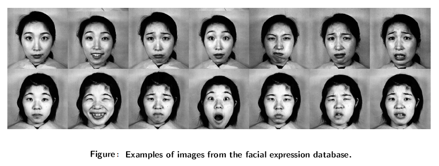

# **Auto FER (Facial Expression Recognition)**

---

I implemented two techniques for auto-FER. 

* First, I retrained AlexNet, used transfer learning for classification(Transfer Learning). 

* Second, I used AlexNet for feature extraction and cascaded it with an SVM for classification. 

I achieved 93% accuracy with AlexNet and 95% with AlexNet-SVM cascade which is comparable with the contemporary methods that give 96-98%. Data augmentation and training with larger dataset can improve the accuracy with deep learning

I used [JAFFE Data Set](https://http://www.kasrl.org/jaffe.html) to train my both models.

## The Japanese Female Facial Expression (JAFFE) Database:
The database contains 213 images of 7 facial expressions (6 basic facial expressions + 1 neutral) posed by 10 Japanese female models. Each image has been rated on 6 emotion adjectives by 60 Japanese subjects. 

---

## Details:

#### Preprocessing:
Since AlexNet only accepts the image with input size of 227x227x3, so we replicated the channel three times to converted our single channel grayscale images of JAFFE to three channels. Also, the input image size was different so, we resized the image. 

With the help of viola jones algorithm, we detect the faces from images and then cropped it. Its implementation is available in Matlab Computer Vision toolbox and the main functionality of viola jones algorithm is to give the object detection bounding box. 

---

### Method 1 (Transfer Learning):
For the Fully Connected layer and initial learning, we considered multiple parameters I.e. mini-batch size, max epochs, WeightLearnRateFactor and BiasLearnRateFactor, as mentioned in referenced paper. 

The last three layers of pretrained network alexnet are configured for 1000 classes however, we performed fine-tuning of these classes since we wanted to detect 5 classes. For our classification, 23rd fully connected layer was changed to 5 and we also retrained the subsequent two softmax and classification output layers. 

---

### Method 2 (Feature Extraction Using Alexnet):

In our second approach implementation, features were extracted from the fully connected layer FC7 of Alexnet. Based on this, the feature vector and feature matrix with training labels were formed and fed them to the SVM which is, in our case, a MATLAB Machine Learning toolbox built-in classifier.  

### Performance:
Random splitting with 30-70 ratio was done for the test and train images which lead to different accuracy for each split. However, to calculate more stable accuracy, we can use k-fold cross validation. We made an observation that the cropping face gave less accuracy. 

We achieved 93% and 95% accuracy for transfer learning and feature extraction-SVM approach respectively. 

---

Note: It took 5 hours with 10 epochs to train the first approach on core i5 with 4 gb RAM.

## Reference Paper:
Tanner Gilligan and Baris Akis, “Emotion AI, Real-Time Emotion Detection using CNN”, Stanford
project.

